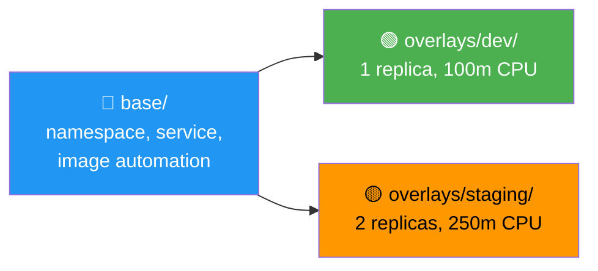

# gitops-fluxcd

Author:** Emad Ahmed  
Cluster:** myapp-eks (eu-west-1)  
Environments:** dev, staging  

This is the GitOps repository for managing everything that runs inside the EKS cluster — applications, infrastructure controllers, monitoring, logging, and security policies. Flux watches this repo and keeps the cluster in sync with whatever is committed here. Push a change, Flux applies it. That's the whole workflow.

The EKS cluster itself is provisioned by Terraform in [eks-automation-iac](https://github.com/emad2013/eks-automation-iac).

---

## Architecture

"
graph TB
    GIT["GitHub — gitops-fluxcd-->Single Source of Truth"]

    subgraph FLUX[" Flux Controllers (flux-system namespace)"]
        SRC["source-controller"]
        KUST["kustomize-controller"]
        HELM["helm-controller"]
        IMGR["image-reflector-controller"]
        IMGA["image-automation-controller"]
    end

    subgraph CLUSTER[" EKS Cluster — myapp-eks"]
        subgraph INFRA["Infrastructure Layer"]
            direction LR
            NETPOL["Network Policies<br/>configs/cluster-network-policies"]
            MONCTRL["Monitoring Controller<br/>kube-prometheus-stack"]
            LOGCTRL["Logging Controller<br/>log aggregation"]
        end

        subgraph APPS[" Application Layer"]
            WEBAPP["webapp Deployment<br/>+ HPA (CPU-based)<br/>+ PDB (min 1 available)"]
            SVC["Service"]
        end

        subgraph SEC[" Security"]
            PSA["Pod Security Admission<br/>patch-namespace-psa<br/>enforce: baseline"]
            CLNETPOL["Cluster Network Policies<br/>default-deny + allow rules"]
        end
    end

    GIT -->|"polls every 5m"| SRC
    SRC --> KUST
    SRC --> HELM
    SRC --> IMGR
    IMGR --> IMGA -->|"auto-commits new tags"| GIT
    KUST --> APPS
    KUST --> SEC
    HELM --> INFRA

---

## How Everything Connects

sequenceDiagram
    participant Dev as Emad (Developer)
    participant Git as GitHub Repo
    participant Flux as Flux Controllers
    participant K8s as EKS Cluster

    Dev->>Git: git push (update manifests)
    Git-->>Flux: source-controller detects change
    Flux->>Flux: kustomize-controller builds manifests
    Flux->>K8s: Apply to cluster
    K8s-->>Flux: Health check result
    alt Healthy
        Flux-->>Git: Mark Kustomization as Ready ✓
    else Unhealthy
        Flux-->>Flux: Retry, revert to last good state
    end

    Note over Flux,Git: Image Automation (automatic)
    Flux->>Flux: image-reflector scans registry
    Flux->>Git: Auto-commit new image tag
    Git-->>Flux: New commit detected
    Flux->>K8s: Deploy updated image

---

## Repository Structure

```
gitops-fluxcd/
├── .sourceignore
│
├── clusters/
│   ├── dev/
│   │   └── myapp-eks/
│   │       │
│   │       ├── apps/
│   │       │   └── webapp/
│   │       │       ├── base/                                   # Shared manifests
│   │       │       │   ├── kustomization.yaml
│   │       │       │   ├── namespace.yaml
│   │       │       │   ├── service.yaml
│   │       │       │   ├── imagepolicy.yaml
│   │       │       │   ├── imagerepository.yaml
│   │       │       │   └── imageupdateautomation.yaml
│   │       │       │
│   │       │       └── overlays/
│   │       │           ├── kustomization.yaml
│   │       │           ├── dev/                                # Dev patches
│   │       │           └── staging/                            # Staging patches
│   │       │
│   │       ├── flux-system/                                    # Flux bootstrap + Kustomizations
│   │       │   ├── gotk-components.yaml                        # Flux controllers (auto-generated)
│   │       │   ├── gotk-sync.yaml                              # GitRepository + root Kustomization
│   │       │   ├── kustomization.yaml                          # References all .yaml in this dir
│   │       │   ├── webapp.yaml                                 # Kustomization → apps/webapp
│   │       │   ├── monitoring.yaml                             # Kustomization → monitoring stack
│   │       │   ├── logging.yaml                                # Kustomization → logging stack
│   │       │   ├── patch-namespace-psa.yaml                    # Kustomization → PSA labels
│   │       │   └── cluster-network-policies.yaml               # Kustomization → NetworkPolicies
│   │       │
│   │       └── infrastructure/
│   │           ├── configs/
│   │           │   └── cluster-network-policies/               # Network policy manifests
│   │           │       ├── kustomization.yaml
│   │           │       ├── 00-label-namespaces.yaml            # Namespace labels for policy targeting
│   │           │       ├── 10-cluster-default-deny-ingress.yaml # Default-deny ingress per namespace
│   │           │       └── 20-webapp-allow-ingress-netpol.yaml  # Allow rules for webapp traffic
│   │           │
│   │           └── controllers/
│   │               ├── logging/                                # Logging stack Helm chart
│   │               │   └── ...
│   │               └── monitoring/                             # kube-prometheus-stack Helm chart
│   │                   └── ...
│   │
│   └── staging/
│       └── myapp-eks/                                          # Staging cluster (same pattern)
│
└── .sourceignore
```

### What Each Directory Does

| Path | Purpose |
|------|---------|
| **`flux-system/`** | Flux bootstrap files and all Kustomization definitions that orchestrate what gets deployed |
| **`flux-system/webapp.yaml`** | Flux Kustomization pointing to `apps/webapp/overlays/dev` with Deployment health checks |
| **`flux-system/monitoring.yaml`** | Flux Kustomization for kube-prometheus-stack |
| **`flux-system/logging.yaml`** | Flux Kustomization for log aggregation |
| **`flux-system/patch-namespace-psa.yaml`** | Flux Kustomization applying Pod Security Admission labels to namespaces |
| **`flux-system/cluster-network-policies.yaml`** | Flux Kustomization pointing to `infrastructure/configs/cluster-network-policies/` |
| **`apps/webapp/base/`** | Shared Kubernetes manifests: namespace, service, image automation resources |
| **`apps/webapp/overlays/dev/`** | Dev environment patches — lower replicas, smaller resource limits |
| **`apps/webapp/overlays/staging/`** | Staging environment patches — closer to production |
| **`infrastructure/configs/cluster-network-policies/`** | Numbered NetworkPolicy manifests applied in order: namespace labels → default-deny → allow rules |
| **`infrastructure/controllers/monitoring/`** | kube-prometheus-stack Helm chart (Prometheus + Grafana) |
| **`infrastructure/controllers/logging/`** | Logging stack Helm chart for log aggregation |

---

## Application Deployment

### Base + Overlays Pattern

I structured the webapp using Kustomize base/overlays so the same app can be deployed to dev and staging with environment-specific patches:



### Scalability — HPA (CPU-based)

The webapp deployment includes CPU resource requests, which the Metrics Server uses to feed the Horizontal Pod Autoscaler. When CPU utilization exceeds the threshold (e.g., 50%), HPA scales pods up. Karpenter then handles node provisioning if existing nodes can't fit the new pods.

```
Traffic spike → CPU rises above 50%
    → HPA scales pods (1 → 5)
        → Pods unschedulable (no node capacity)
            → Karpenter provisions new EC2 instance
                → Pods scheduled on new node ✓
```

### Resilience — Pod Disruption Budget

A PodDisruptionBudget is configured for the webapp to ensure at least one pod stays running during voluntary disruptions — node drains, Karpenter node rotation, cluster upgrades. This prevents downtime during maintenance.

### Automated Rollbacks

Flux monitors deployment health. If a bad image is pushed and the Deployment never becomes Ready within the timeout, Flux keeps the Kustomization in a `NotReady` state. On the next reconciliation, it reapplies from Git — effectively reverting to the last working version.

### Automated Image Updates

The image automation controllers handle patch/bugfix upgrades automatically:

| Resource | What It Does |
|----------|-------------|
| `imagerepository.yaml` | Tells Flux which container registry to scan for new tags |
| `imagepolicy.yaml` | Defines which tags to accept (e.g., semver `~1.x` for patch updates only) |
| `imageupdateautomation.yaml` | Auto-commits the new tag back to this Git repo, triggering deployment |

---

## Security

### Network Policies (infrastructure/configs/cluster-network-policies/)

Network policies are applied in numbered order to ensure correct layering:

| File | Purpose |
|------|---------|
| `00-label-namespaces.yaml` | Applies labels to namespaces used as selectors in policy rules |
| `10-cluster-default-deny-ingress.yaml` | Default-deny all ingress traffic per namespace — blocks everything unless explicitly allowed |
| `20-webapp-allow-ingress-netpol.yaml` | Allows specific ingress to webapp pods (e.g., from ALB, Prometheus scraping) |

### Pod Security Admission (patch-namespace-psa.yaml)

Namespace labels enforce the "baseline" Pod Security Standard (blocks privileged containers, host networking) and warn/audit on "restricted" violations. Managed via `flux-system/patch-namespace-psa.yaml`.

| Layer | Implementation |
|-------|---------------|
| **Node AMI** | Amazon Linux 2 (AL2) — AWS-optimized for EKS with security patches, set via `amiFamily: AL2` |
| **IMDSv2** | Enforced on all Karpenter nodes (`httpTokens: required`) — prevents SSRF attacks |
| **Pod Security** | PSA labels: enforce=baseline, warn=restricted, audit=restricted |
| **Network Policies** | Numbered policies: default-deny → explicit allow per namespace |
| **Private Networking** | All worker nodes in private subnets |
| **RBAC** | Namespace-scoped for developers, cluster-wide read-only for admins |

---

## Monitoring & Logging

### Monitoring — kube-prometheus-stack

Deployed via `infrastructure/controllers/monitoring/` and referenced by `flux-system/monitoring.yaml`. Provides Prometheus (metrics), Grafana (dashboards), node-exporter (host metrics), and kube-state-metrics (K8s object metrics).

```bash
# Access Grafana
kubectl port-forward svc/kube-prometheus-stack-grafana 3000:80 -n monitoring
# → http://localhost:3000 — admin / prom-operator
```

### Logging

Deployed via `infrastructure/controllers/logging/` and referenced by `flux-system/logging.yaml`. Aggregates logs from all nodes and pods for centralized viewing and troubleshooting.

---

## Useful Commands

| Task | Command |
|------|---------|
| Check all Kustomizations | `flux get kustomizations` |
| Check Git source | `flux get sources git` |
| Check HelmReleases | `flux get helmreleases -A` |
| Check image policies | `flux get images all -A` |
| Force sync from Git | `flux reconcile source git flux-system` |
| Force apply | `flux reconcile kustomization flux-system` |
| Sync webapp only | `flux reconcile kustomization webapp` |
| Suspend Flux (manual fix) | `flux suspend kustomization flux-system` |
| Resume Flux | `flux resume kustomization flux-system` |
| Flux error logs | `flux logs --level=error` |
| Karpenter status | `kubectl get ec2nodeclass && kubectl get nodepool` |
| Karpenter logs | `kubectl logs -n karpenter -l app.kubernetes.io/name=karpenter --tail=50` |

---

## Troubleshooting

| # | Issue | Root Cause | How I Fixed It |
|---|-------|-----------|----------------|
| 1 | **Flux bootstrap timeout** — kustomization not ready | EC2NodeClass was failing, blocking the entire Flux health check chain | Fixed all Karpenter IAM issues first (items 2–4), then re-ran Terraform |
| 2 | **EC2NodeClass "Failed to resolve instance profile"** | `role` field referenced `KarpenterNodeRole-myapp-eks` but Terraform names it with a timestamp suffix | Retrieved correct name via `aws iam list-roles`, updated manifest in git |
| 3 | **EC2NodeClass `spec.role` immutable** — Flux dry-run rejected | Karpenter v1beta1 blocks patches to `spec.role` | Suspended Flux, `kubectl delete ec2nodeclass default`, pushed fix, resumed Flux |
| 4 | **Missing SSM policy** on Karpenter node role | Only 3 of 4 required policies attached — without `AmazonSSMManagedInstanceCore`, nodes can't bootstrap | `aws iam attach-role-policy` to add it, plus updated Terraform to prevent drift |
| 5 | **LBC webhook "no endpoints"** during Karpenter install | Karpenter's Helm chart creates a Service, triggering the LBC webhook before it was ready | Implemented staged deployment with `wait_for_lbc` in Terraform |
| 6 | **Kustomize `../base` path not found** | From `overlays/dev/`, `../base` resolves to `overlays/base` — wrong. Need `../../base` | Fixed relative path to `../../base` in the overlay kustomization.yaml |
| 7 | **PVC not binding** — FailedScheduling | Pod required PersistentVolumeClaim but StorageClass or EBS CSI driver was missing | Verified EBS CSI driver with `kubectl get pods -n kube-system \| grep ebs` |

---

## Multi-Environment Support

```
clusters/
├── dev/myapp-eks/          ← Dev (active)
└── staging/myapp-eks/      ← Staging (same pattern)
```

Each cluster path has its own `flux-system/`, `apps/`, and `infrastructure/` directories. Base manifests are shared through Kustomize overlays — write once, patch per environment.

---

## Making Changes

```bash
# 1. Edit any manifest
vim clusters/dev/myapp-eks/apps/webapp/base/service.yaml

# 2. Commit and push
git add . && git commit -m "update webapp service" && git push

# 3. Flux applies it automatically (within 5 minutes)
#    Or force immediate sync:
flux reconcile source git flux-system
```

That's it. No `kubectl apply`, no CI pipeline needed for manifest changes. Git is the interface.

---

## Related Repositories

| Repo | Purpose |
|------|---------|
| [eks-automation-iac](https://github.com/emad2013/eks-automation-iac) | Terraform — provisions EKS cluster, VPC, IAM, addons, and bootstraps Flux to this repo |

---

> Built by **Emad Ahmed** — managing Kubernetes workloads the GitOps way.
